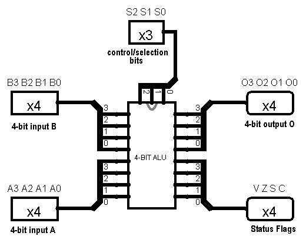
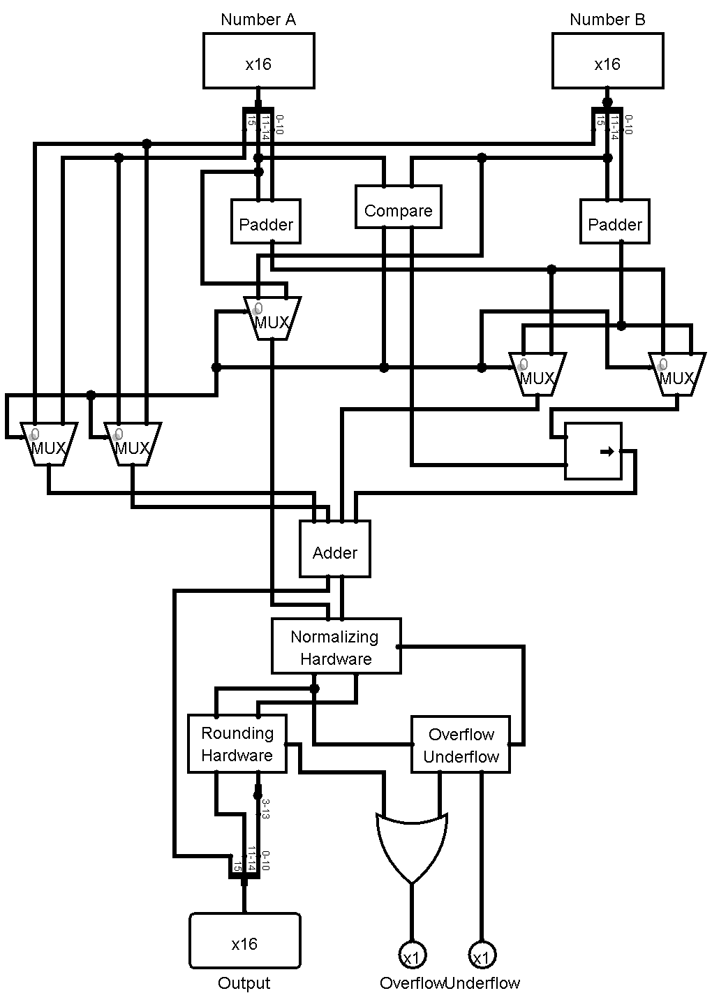
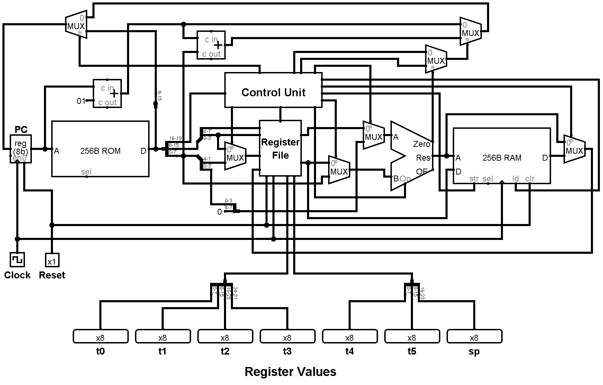
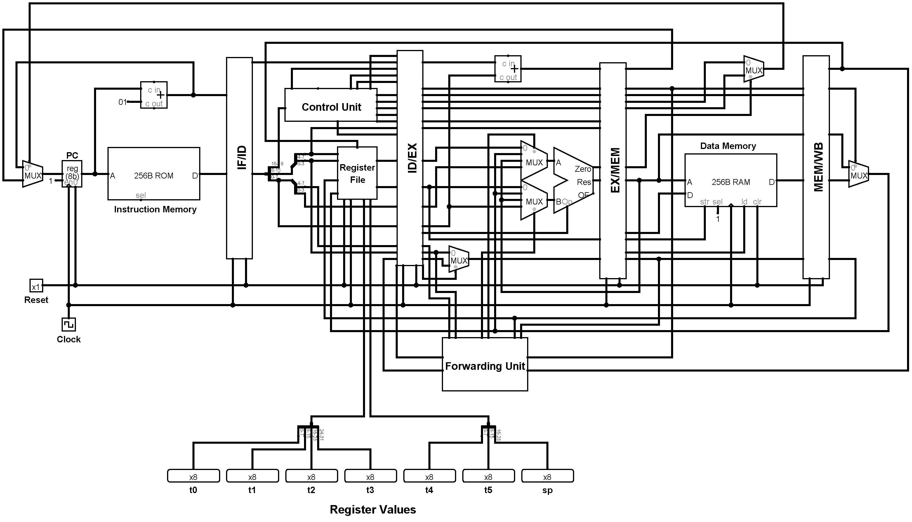

### CSE 306 - Computer Architecture
# Simulation Based Lab Assignments of Computer Architecture Course
___
### Contributors :

| Name              | Email                    |
| ----------------- | ------------------------ |
| [Nazmul Takbir](https://github.com/NazmulTakbir)     | nazmultakbir98@gmail.com |
| [Saif Ahmed Khan](https://github.com/ksaifahmed) | ksaifahmed4@gmail.com      |
| [Fatima Nawmi](https://github.com/fatimanawmi)     | fatimanawmi@gmail.com |
| [Sihat Afnan](https://github.com/AfnanCSE98) | sihatafnan15.9.1997@gmail.com      |
| [Shariful Islam](https://www.facebook.com/MYNAMEISSHARIFUL) | sharifulislam08031998@gmail.com      |
___
## Assignment 1 - 4 bit ALU Simulation

## Assignment 2 - 16 bit Floating Point Adder Simulation

## Assignment 3 - 8 MIPS Microprocessor Single Cycle Implementation Simulation

## Assignment 4 - 8 MIPS Microprocessor Pipelined Implementation Simulation

### Use [this](https://github.com/buetcse17/Logisim-Circuit-Tester) repository for automated testing 
